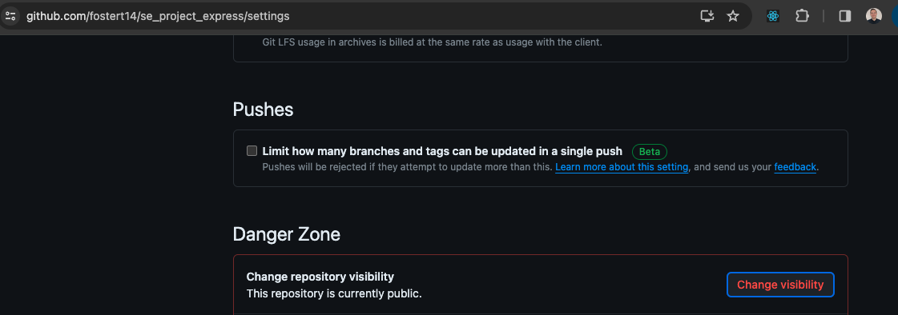
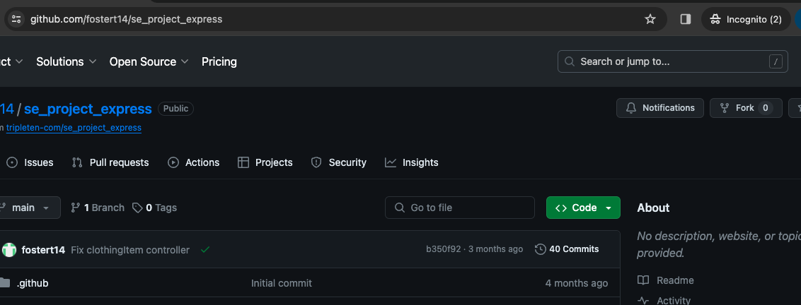

# React Weather App

## Brief Description

The React Weather App is a dynamic, user-friendly application designed to provide clothing suggestions based on current weather conditions.

## Features

- **Weather Forecast:** Displays current weather conditions, including temperature, to inform users of the day's weather.
- **Clothing Suggestions:** Offers personalized clothing recommendations that are suitable for the day's weather conditions.
- **User Authentication:** Allows users to register and login to access more personalized features.
- **Like Functionality:** Users can like their favorite clothing items for future reference.
- **Profile Customization:** Users can edit their profile and upload custom avatars.

## Technologies Used

- **React:** Utilizes React for building the user interface and managing the application state.
- **Context API:** Leverages React's Context API for managing global state, such as the current temperature unit and user authentication status.
- **Local Storage:** Uses local storage to persist user authentication tokens and user preferences.
- **Responsive Design:** Ensures a seamless experience across various devices and screen sizes.

## Setup Instructions

1. Clone the repository to your local machine.
2. Navigate to the project directory and install dependencies with `npm install`.
3. Start the development server with `npm start`. The application should open automatically in your default web browser.

## Link to back-end repo

https://github.com/fostert14/se_project_express.git

## Images showing my repo is public

## Planned Improvements

- **Image Upload Feature:** Allow users to upload their own clothing item images, enhancing the personalization of suggestions.
- **Expand Weather Data:** Integrate more comprehensive weather data to provide suggestions for a wider range of weather conditions.
- **Add Like Counter:** Integrate a like counter based on the array of users that have liked an item card.
